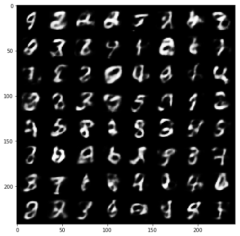
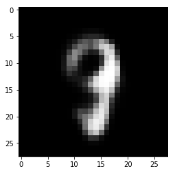
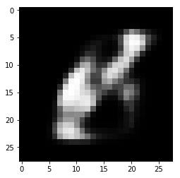
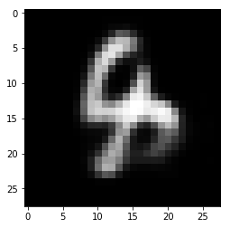

# Variational Autoencoder

- Basic implementation of VAE on MNIST 
- Understand KL-Divergence
- Understand Reparameterization trick

## Paper Review

- Kingma and Welling. Auto-Encoding Variational Bayes. ICLR, 2014
- URL : https://arxiv.org/abs/1312.6114
- Explanation #1 : AISC Foundational https://www.youtube.com/watch?v=Tc-XfiDPLf4

> Variational Approximation -> Deep Latent Variable Models -> Variational Autoencoding

- Explanation #2 : https://towardsdatascience.com/intuitively-understanding-variational-autoencoders-1bfe67eb5daf


Probabilistic Graphical methods

System is a collection of random variables (RVs) : Observations and Latent Variables.
- Observations : Data for e.g. MNIST
- Latent Variables : Cannot observe directly. Need to be inferred.
- Model Parameters $\theta{}$
- Goal : To learn $\theta{}$
- The observations are samples of a true distribution $p(x)$
- Hard to find $p(x)$! One way to find it is integrating likelihood over the entire latent space.
- Very hard to compute the posterior and marginal likelihood
- Intractable posterior -> No EM (expectation maximization)
- Variational Approximation to compute posterior!

> Intractable distributions : Distributions where cannot be solved in polynomial time

### Variational Approximation

- Find an approximate to the interactable true $p_{\theta{}}(z|x)$

## Code


```python
from google.colab import drive
drive.mount('/content/drive')
```

    Go to this URL in a browser: https://accounts.google.com/o/oauth2/auth?client_id=947318989803-6bn6qk8qdgf4n4g3pfee6491hc0brc4i.apps.googleusercontent.com&redirect_uri=urn%3Aietf%3Awg%3Aoauth%3A2.0%3Aoob&scope=email%20https%3A%2F%2Fwww.googleapis.com%2Fauth%2Fdocs.test%20https%3A%2F%2Fwww.googleapis.com%2Fauth%2Fdrive%20https%3A%2F%2Fwww.googleapis.com%2Fauth%2Fdrive.photos.readonly%20https%3A%2F%2Fwww.googleapis.com%2Fauth%2Fpeopleapi.readonly&response_type=code
    
    Enter your authorization code:
    ··········
    Mounted at /content/drive


```python
# path = Path('drive/My Drive/vae')
path = 'drive/My Drive/vae/'
```


```python
ls '{path}'
```

## Libraries


```python
from __future__ import print_function
import argparse
import torch
import torch.utils.data
from torch import nn, optim
from torch.nn import functional as F
from torchvision import datasets, transforms
from torchvision.utils import save_image, make_grid
from pathlib import Path
import matplotlib.pyplot as plt

%load_ext autoreload
%autoreload 2
```

    The autoreload extension is already loaded. To reload it, use:
      %reload_ext autoreload


## Hyperparameters


```python
batch_size = 128
lr = 1e-3
epochs = 5
seed = 42
log_interval = 10 # how many batches to wait before logging training status
cuda = torch.cuda.is_available()
torch.manual_seed(seed)
device = torch.device("cuda" if cuda else "cpu")
kwargs = {'num_workers': 4, 'pin_memory': True} if cuda else {}
```

## Dataloaders


```python
train_loader = torch.utils.data.DataLoader(
    datasets.MNIST('../data', train=True, download=True,
                   transform=transforms.ToTensor()),
    batch_size=batch_size, shuffle=True, **kwargs)

test_loader = torch.utils.data.DataLoader(
    datasets.MNIST('../data', train=False, transform=transforms.ToTensor()),
    batch_size=batch_size, shuffle=True, **kwargs)
```

## Model Class

- `torch.rand_like` : Returns a tensor with the same size as `input` that is filled with random numbers from a uniform distribution on the interval `[0, 1)`.


```python
class VAE(nn.Module):
    def __init__(self):
        super(VAE, self).__init__() # calls the __init__ of the parent class

        self.encoder = nn.Sequential(
                                nn.Linear(in_features=784, out_features=400),
                                nn.ReLU(inplace=True)
                        )
        
        self.mean_vector = nn.Linear(in_features=400, out_features=20)
        self.logvar_vector = nn.Linear(in_features=400, out_features=20)

        self.decoder = nn.Sequential(
                                nn.Linear(in_features=20, out_features=400),
                                nn.ReLU(inplace=True),
                                nn.Linear(in_features=400, out_features=784),
                                nn.Sigmoid()
                         )

    def encode(self, x):
        h1 = self.encoder(x)
        return self.mean_vector(h1), self.logvar_vector(h1)

    def reparameterize(self, mu, logvar):
        std = torch.exp(0.5*logvar)
        eps = torch.randn_like(std)
        return mu + eps*std

    def decode(self, z):
        return self.decoder(z)

    def forward(self, x):
        mu, logvar = self.encode(x.view(-1, 784))
        
        # Sample from the latent distribution
        z = self.reparameterize(mu, logvar)
        return self.decode(z), mu, logvar

```

### Model initialization + optimizer


```python
model = VAE().to(device)
optimizer = optim.Adam(model.parameters(), lr=lr)
```

### Loss function


```python
# Reconstruction + KL divergence losses summed over all elements and batch
def loss_function(recon_x, x, mu, logvar):
    BCE = F.binary_cross_entropy(recon_x, x.view(-1, 784), reduction='sum')

    # see Appendix B from VAE paper:
    # Kingma and Welling. Auto-Encoding Variational Bayes. ICLR, 2014
    # https://arxiv.org/abs/1312.6114
    # 0.5 * sum(1 + log(sigma^2) - mu^2 - sigma^2)
    KLD = -0.5 * torch.sum(1 + logvar - mu.pow(2) - logvar.exp())

    return BCE + KLD
```

## Training and Testing


```python
def train(epoch):
    
    model.train()
    train_loss = 0

    for batch_idx, (data, _) in enumerate(train_loader):

        # Converting data to suitable device
        data = data.to(device)

        # Clearing gradients from previous iteration
        optimizer.zero_grad()

        # Forward pass
        recon_batch, mu, logvar = model(data)
        # Computing loss
        loss = loss_function(recon_batch, data, mu, logvar)

        # Backward pass
        loss.backward()
        train_loss += loss.item()
        optimizer.step()

        # Logging 
        if batch_idx % log_interval == 0:
            print('Train Epoch: {} [{}/{} ({:.0f}%)]\tLoss: {:.6f}'.format(
                epoch, batch_idx * len(data), len(train_loader.dataset),
                100. * batch_idx / len(train_loader),
                loss.item() / len(data)))

    print('====> Epoch: {} Average loss: {:.4f}'.format(
          epoch, train_loss / len(train_loader.dataset)))


def test(epoch):

    model.eval()
    test_loss = 0
    
    with torch.no_grad():

        for i, (data, _) in enumerate(test_loader):

            data = data.to(device)

            recon_batch, mu, logvar = model(data)
            test_loss += loss_function(recon_batch, data, mu, logvar).item()

            if i == 0:
                n = min(data.size(0), 8)
                comparison = torch.cat([data[:n],
                                      recon_batch.view(batch_size, 1, 28, 28)[:n]])
                
                # make grid (2 rows and 5 columns)
                grid_img = make_grid(comparison.cpu(), nrow=n)

                # reshape and plot
                plt.imshow(grid_img.permute(1, 2, 0));
                plt.show();

                save_image(comparison.cpu(),
                         path + 'reconstruction_' + str(epoch) + '.png', nrow=n)

    test_loss /= len(test_loader.dataset)
    print('====> Test set loss: {:.4f}'.format(test_loss))
```

## Training Loop


```python
for epoch in range(1, epochs + 1):
    train(epoch)
    test(epoch)
```

    Train Epoch: 1 [0/60000 (0%)]	Loss: 547.430908
    Train Epoch: 1 [1280/60000 (2%)]	Loss: 300.487213
    Train Epoch: 1 [2560/60000 (4%)]	Loss: 240.536148
    Train Epoch: 1 [3840/60000 (6%)]	Loss: 214.056000
    Train Epoch: 1 [5120/60000 (9%)]	Loss: 220.038651
    Train Epoch: 1 [6400/60000 (11%)]	Loss: 204.581131
    Train Epoch: 1 [7680/60000 (13%)]	Loss: 207.294235
    Train Epoch: 1 [8960/60000 (15%)]	Loss: 202.427612
    Train Epoch: 1 [10240/60000 (17%)]	Loss: 188.894867
    Train Epoch: 1 [11520/60000 (19%)]	Loss: 190.157074
    Train Epoch: 1 [12800/60000 (21%)]	Loss: 183.330368
    Train Epoch: 1 [14080/60000 (23%)]	Loss: 178.415344
    Train Epoch: 1 [15360/60000 (26%)]	Loss: 176.967682
    Train Epoch: 1 [16640/60000 (28%)]	Loss: 170.882385
    Train Epoch: 1 [17920/60000 (30%)]	Loss: 164.829636
    Train Epoch: 1 [19200/60000 (32%)]	Loss: 155.518707
    Train Epoch: 1 [20480/60000 (34%)]	Loss: 164.312805
    Train Epoch: 1 [21760/60000 (36%)]	Loss: 158.647324
    Train Epoch: 1 [23040/60000 (38%)]	Loss: 153.709641
    Train Epoch: 1 [24320/60000 (41%)]	Loss: 149.408600
    Train Epoch: 1 [25600/60000 (43%)]	Loss: 153.465103
    Train Epoch: 1 [26880/60000 (45%)]	Loss: 150.947372
    Train Epoch: 1 [28160/60000 (47%)]	Loss: 147.883072
    Train Epoch: 1 [29440/60000 (49%)]	Loss: 149.980530
    Train Epoch: 1 [30720/60000 (51%)]	Loss: 145.390335
    Train Epoch: 1 [32000/60000 (53%)]	Loss: 141.319336
    Train Epoch: 1 [33280/60000 (55%)]	Loss: 146.790634
    Train Epoch: 1 [34560/60000 (58%)]	Loss: 144.081131
    Train Epoch: 1 [35840/60000 (60%)]	Loss: 144.777893
    Train Epoch: 1 [37120/60000 (62%)]	Loss: 131.251312
    Train Epoch: 1 [38400/60000 (64%)]	Loss: 139.303101
    Train Epoch: 1 [39680/60000 (66%)]	Loss: 142.180420
    Train Epoch: 1 [40960/60000 (68%)]	Loss: 138.248901
    Train Epoch: 1 [42240/60000 (70%)]	Loss: 139.828842
    Train Epoch: 1 [43520/60000 (72%)]	Loss: 133.153030
    Train Epoch: 1 [44800/60000 (75%)]	Loss: 139.516739
    Train Epoch: 1 [46080/60000 (77%)]	Loss: 136.284561
    Train Epoch: 1 [47360/60000 (79%)]	Loss: 132.503983
    Train Epoch: 1 [48640/60000 (81%)]	Loss: 130.246674
    Train Epoch: 1 [49920/60000 (83%)]	Loss: 135.574402
    Train Epoch: 1 [51200/60000 (85%)]	Loss: 132.561218
    Train Epoch: 1 [52480/60000 (87%)]	Loss: 134.291901
    Train Epoch: 1 [53760/60000 (90%)]	Loss: 130.075500
    Train Epoch: 1 [55040/60000 (92%)]	Loss: 129.639999
    Train Epoch: 1 [56320/60000 (94%)]	Loss: 134.753159
    Train Epoch: 1 [57600/60000 (96%)]	Loss: 124.715874
    Train Epoch: 1 [58880/60000 (98%)]	Loss: 125.896606
    ====> Epoch: 1 Average loss: 164.0311


    ====> Test set loss: 126.5190
    Train Epoch: 2 [0/60000 (0%)]	Loss: 129.491943
    Train Epoch: 2 [1280/60000 (2%)]	Loss: 131.792679
    Train Epoch: 2 [2560/60000 (4%)]	Loss: 125.262527
    Train Epoch: 2 [3840/60000 (6%)]	Loss: 130.454391
    Train Epoch: 2 [5120/60000 (9%)]	Loss: 128.511780
    Train Epoch: 2 [6400/60000 (11%)]	Loss: 124.755562
    Train Epoch: 2 [7680/60000 (13%)]	Loss: 126.823547
    Train Epoch: 2 [8960/60000 (15%)]	Loss: 127.894974
    Train Epoch: 2 [10240/60000 (17%)]	Loss: 122.389580
    Train Epoch: 2 [11520/60000 (19%)]	Loss: 121.023590
    Train Epoch: 2 [12800/60000 (21%)]	Loss: 118.349754
    Train Epoch: 2 [14080/60000 (23%)]	Loss: 118.846436
    Train Epoch: 2 [15360/60000 (26%)]	Loss: 121.012871
    Train Epoch: 2 [16640/60000 (28%)]	Loss: 123.811340
    Train Epoch: 2 [17920/60000 (30%)]	Loss: 121.507065
    Train Epoch: 2 [19200/60000 (32%)]	Loss: 122.622131
    Train Epoch: 2 [20480/60000 (34%)]	Loss: 124.899704
    Train Epoch: 2 [21760/60000 (36%)]	Loss: 119.538422
    Train Epoch: 2 [23040/60000 (38%)]	Loss: 118.717773
    Train Epoch: 2 [24320/60000 (41%)]	Loss: 121.547714
    Train Epoch: 2 [25600/60000 (43%)]	Loss: 121.724442
    Train Epoch: 2 [26880/60000 (45%)]	Loss: 122.026489
    Train Epoch: 2 [28160/60000 (47%)]	Loss: 117.962799
    Train Epoch: 2 [29440/60000 (49%)]	Loss: 120.079361
    Train Epoch: 2 [30720/60000 (51%)]	Loss: 119.084099
    Train Epoch: 2 [32000/60000 (53%)]	Loss: 116.840302
    Train Epoch: 2 [33280/60000 (55%)]	Loss: 119.729294
    Train Epoch: 2 [34560/60000 (58%)]	Loss: 118.906387
    Train Epoch: 2 [35840/60000 (60%)]	Loss: 117.740852
    Train Epoch: 2 [37120/60000 (62%)]	Loss: 116.073837
    Train Epoch: 2 [38400/60000 (64%)]	Loss: 119.792839
    Train Epoch: 2 [39680/60000 (66%)]	Loss: 117.364059
    Train Epoch: 2 [40960/60000 (68%)]	Loss: 122.524071
    Train Epoch: 2 [42240/60000 (70%)]	Loss: 113.382645
    Train Epoch: 2 [43520/60000 (72%)]	Loss: 119.342155
    Train Epoch: 2 [44800/60000 (75%)]	Loss: 119.748802
    Train Epoch: 2 [46080/60000 (77%)]	Loss: 122.427353
    Train Epoch: 2 [47360/60000 (79%)]	Loss: 116.607475
    Train Epoch: 2 [48640/60000 (81%)]	Loss: 123.244949
    Train Epoch: 2 [49920/60000 (83%)]	Loss: 113.743317
    Train Epoch: 2 [51200/60000 (85%)]	Loss: 116.827042
    Train Epoch: 2 [52480/60000 (87%)]	Loss: 115.485489
    Train Epoch: 2 [53760/60000 (90%)]	Loss: 120.406082
    Train Epoch: 2 [55040/60000 (92%)]	Loss: 116.319176
    Train Epoch: 2 [56320/60000 (94%)]	Loss: 118.767891
    Train Epoch: 2 [57600/60000 (96%)]	Loss: 116.160797
    Train Epoch: 2 [58880/60000 (98%)]	Loss: 119.502541
    ====> Epoch: 2 Average loss: 120.6430


    ====> Test set loss: 115.1079
    Train Epoch: 3 [0/60000 (0%)]	Loss: 120.885696
    Train Epoch: 3 [1280/60000 (2%)]	Loss: 117.450981
    Train Epoch: 3 [2560/60000 (4%)]	Loss: 110.779701
    Train Epoch: 3 [3840/60000 (6%)]	Loss: 116.819458
    Train Epoch: 3 [5120/60000 (9%)]	Loss: 110.139366
    Train Epoch: 3 [6400/60000 (11%)]	Loss: 116.191788
    Train Epoch: 3 [7680/60000 (13%)]	Loss: 113.022217
    Train Epoch: 3 [8960/60000 (15%)]	Loss: 111.434044
    Train Epoch: 3 [10240/60000 (17%)]	Loss: 114.087357
    Train Epoch: 3 [11520/60000 (19%)]	Loss: 114.536728
    Train Epoch: 3 [12800/60000 (21%)]	Loss: 119.094093
    Train Epoch: 3 [14080/60000 (23%)]	Loss: 112.937805
    Train Epoch: 3 [15360/60000 (26%)]	Loss: 114.059074
    Train Epoch: 3 [16640/60000 (28%)]	Loss: 115.576607
    Train Epoch: 3 [17920/60000 (30%)]	Loss: 114.999542
    Train Epoch: 3 [19200/60000 (32%)]	Loss: 117.455910
    Train Epoch: 3 [20480/60000 (34%)]	Loss: 116.043549
    Train Epoch: 3 [21760/60000 (36%)]	Loss: 111.470688
    Train Epoch: 3 [23040/60000 (38%)]	Loss: 111.531860
    Train Epoch: 3 [24320/60000 (41%)]	Loss: 113.189514
    Train Epoch: 3 [25600/60000 (43%)]	Loss: 115.271591
    Train Epoch: 3 [26880/60000 (45%)]	Loss: 116.696274
    Train Epoch: 3 [28160/60000 (47%)]	Loss: 112.587708
    Train Epoch: 3 [29440/60000 (49%)]	Loss: 114.316605
    Train Epoch: 3 [30720/60000 (51%)]	Loss: 113.618217
    Train Epoch: 3 [32000/60000 (53%)]	Loss: 119.434769
    Train Epoch: 3 [33280/60000 (55%)]	Loss: 110.648346
    Train Epoch: 3 [34560/60000 (58%)]	Loss: 116.497849
    Train Epoch: 3 [35840/60000 (60%)]	Loss: 113.694107
    Train Epoch: 3 [37120/60000 (62%)]	Loss: 117.068352
    Train Epoch: 3 [38400/60000 (64%)]	Loss: 111.564133
    Train Epoch: 3 [39680/60000 (66%)]	Loss: 109.947388
    Train Epoch: 3 [40960/60000 (68%)]	Loss: 116.443428
    Train Epoch: 3 [42240/60000 (70%)]	Loss: 117.060478
    Train Epoch: 3 [43520/60000 (72%)]	Loss: 116.885521
    Train Epoch: 3 [44800/60000 (75%)]	Loss: 112.141190
    Train Epoch: 3 [46080/60000 (77%)]	Loss: 116.815155
    Train Epoch: 3 [47360/60000 (79%)]	Loss: 113.394775
    Train Epoch: 3 [48640/60000 (81%)]	Loss: 113.536514
    Train Epoch: 3 [49920/60000 (83%)]	Loss: 115.737595
    Train Epoch: 3 [51200/60000 (85%)]	Loss: 110.885544
    Train Epoch: 3 [52480/60000 (87%)]	Loss: 111.010063
    Train Epoch: 3 [53760/60000 (90%)]	Loss: 112.523193
    Train Epoch: 3 [55040/60000 (92%)]	Loss: 113.408432
    Train Epoch: 3 [56320/60000 (94%)]	Loss: 111.678879
    Train Epoch: 3 [57600/60000 (96%)]	Loss: 108.559425
    Train Epoch: 3 [58880/60000 (98%)]	Loss: 115.075287
    ====> Epoch: 3 Average loss: 114.1522


    ====> Test set loss: 111.6379
    Train Epoch: 4 [0/60000 (0%)]	Loss: 110.836365
    Train Epoch: 4 [1280/60000 (2%)]	Loss: 114.846703
    Train Epoch: 4 [2560/60000 (4%)]	Loss: 114.997780
    Train Epoch: 4 [3840/60000 (6%)]	Loss: 111.079521
    Train Epoch: 4 [5120/60000 (9%)]	Loss: 118.038719
    Train Epoch: 4 [6400/60000 (11%)]	Loss: 110.369736
    Train Epoch: 4 [7680/60000 (13%)]	Loss: 111.183289
    Train Epoch: 4 [8960/60000 (15%)]	Loss: 115.633972
    Train Epoch: 4 [10240/60000 (17%)]	Loss: 110.420425
    Train Epoch: 4 [11520/60000 (19%)]	Loss: 114.946793
    Train Epoch: 4 [12800/60000 (21%)]	Loss: 109.538544
    Train Epoch: 4 [14080/60000 (23%)]	Loss: 113.887192
    Train Epoch: 4 [15360/60000 (26%)]	Loss: 113.956665
    Train Epoch: 4 [16640/60000 (28%)]	Loss: 112.439636
    Train Epoch: 4 [17920/60000 (30%)]	Loss: 115.829079
    Train Epoch: 4 [19200/60000 (32%)]	Loss: 110.737885
    Train Epoch: 4 [20480/60000 (34%)]	Loss: 112.565598
    Train Epoch: 4 [21760/60000 (36%)]	Loss: 113.615189
    Train Epoch: 4 [23040/60000 (38%)]	Loss: 111.397034
    Train Epoch: 4 [24320/60000 (41%)]	Loss: 112.380173
    Train Epoch: 4 [25600/60000 (43%)]	Loss: 111.789932
    Train Epoch: 4 [26880/60000 (45%)]	Loss: 111.057419
    Train Epoch: 4 [28160/60000 (47%)]	Loss: 111.773392
    Train Epoch: 4 [29440/60000 (49%)]	Loss: 112.841156
    Train Epoch: 4 [30720/60000 (51%)]	Loss: 108.112381
    Train Epoch: 4 [32000/60000 (53%)]	Loss: 112.705116
    Train Epoch: 4 [33280/60000 (55%)]	Loss: 112.025581
    Train Epoch: 4 [34560/60000 (58%)]	Loss: 110.998497
    Train Epoch: 4 [35840/60000 (60%)]	Loss: 114.575912
    Train Epoch: 4 [37120/60000 (62%)]	Loss: 109.721695
    Train Epoch: 4 [38400/60000 (64%)]	Loss: 107.896698
    Train Epoch: 4 [39680/60000 (66%)]	Loss: 106.860947
    Train Epoch: 4 [40960/60000 (68%)]	Loss: 110.535210
    Train Epoch: 4 [42240/60000 (70%)]	Loss: 116.116913
    Train Epoch: 4 [43520/60000 (72%)]	Loss: 105.804260
    Train Epoch: 4 [44800/60000 (75%)]	Loss: 107.260696
    Train Epoch: 4 [46080/60000 (77%)]	Loss: 113.361542
    Train Epoch: 4 [47360/60000 (79%)]	Loss: 113.409683
    Train Epoch: 4 [48640/60000 (81%)]	Loss: 112.453575
    Train Epoch: 4 [49920/60000 (83%)]	Loss: 107.674400
    Train Epoch: 4 [51200/60000 (85%)]	Loss: 107.932945
    Train Epoch: 4 [52480/60000 (87%)]	Loss: 108.385460
    Train Epoch: 4 [53760/60000 (90%)]	Loss: 107.696236
    Train Epoch: 4 [55040/60000 (92%)]	Loss: 108.531937
    Train Epoch: 4 [56320/60000 (94%)]	Loss: 109.135941
    Train Epoch: 4 [57600/60000 (96%)]	Loss: 114.531815
    Train Epoch: 4 [58880/60000 (98%)]	Loss: 108.120117
    ====> Epoch: 4 Average loss: 111.3156


    ====> Test set loss: 109.6529
    Train Epoch: 5 [0/60000 (0%)]	Loss: 112.495483
    Train Epoch: 5 [1280/60000 (2%)]	Loss: 109.080856
    Train Epoch: 5 [2560/60000 (4%)]	Loss: 110.559341
    Train Epoch: 5 [3840/60000 (6%)]	Loss: 110.801018
    Train Epoch: 5 [5120/60000 (9%)]	Loss: 108.594452
    Train Epoch: 5 [6400/60000 (11%)]	Loss: 110.429176
    Train Epoch: 5 [7680/60000 (13%)]	Loss: 109.552689
    Train Epoch: 5 [8960/60000 (15%)]	Loss: 106.225166
    Train Epoch: 5 [10240/60000 (17%)]	Loss: 111.243736
    Train Epoch: 5 [11520/60000 (19%)]	Loss: 108.523331
    Train Epoch: 5 [12800/60000 (21%)]	Loss: 109.894440
    Train Epoch: 5 [14080/60000 (23%)]	Loss: 108.993164
    Train Epoch: 5 [15360/60000 (26%)]	Loss: 113.355019
    Train Epoch: 5 [16640/60000 (28%)]	Loss: 108.975952
    Train Epoch: 5 [17920/60000 (30%)]	Loss: 107.790573
    Train Epoch: 5 [19200/60000 (32%)]	Loss: 110.243866
    Train Epoch: 5 [20480/60000 (34%)]	Loss: 110.292824
    Train Epoch: 5 [21760/60000 (36%)]	Loss: 112.287384
    Train Epoch: 5 [23040/60000 (38%)]	Loss: 108.765488
    Train Epoch: 5 [24320/60000 (41%)]	Loss: 107.273117
    Train Epoch: 5 [25600/60000 (43%)]	Loss: 110.587723
    Train Epoch: 5 [26880/60000 (45%)]	Loss: 110.162666
    Train Epoch: 5 [28160/60000 (47%)]	Loss: 110.308578
    Train Epoch: 5 [29440/60000 (49%)]	Loss: 112.214714
    Train Epoch: 5 [30720/60000 (51%)]	Loss: 105.870651
    Train Epoch: 5 [32000/60000 (53%)]	Loss: 104.997391
    Train Epoch: 5 [33280/60000 (55%)]	Loss: 110.059029
    Train Epoch: 5 [34560/60000 (58%)]	Loss: 107.067810
    Train Epoch: 5 [35840/60000 (60%)]	Loss: 111.872040
    Train Epoch: 5 [37120/60000 (62%)]	Loss: 109.940926
    Train Epoch: 5 [38400/60000 (64%)]	Loss: 109.412659
    Train Epoch: 5 [39680/60000 (66%)]	Loss: 110.063416
    Train Epoch: 5 [40960/60000 (68%)]	Loss: 107.025543
    Train Epoch: 5 [42240/60000 (70%)]	Loss: 111.553810
    Train Epoch: 5 [43520/60000 (72%)]	Loss: 106.033066
    Train Epoch: 5 [44800/60000 (75%)]	Loss: 107.816116
    Train Epoch: 5 [46080/60000 (77%)]	Loss: 106.645737
    Train Epoch: 5 [47360/60000 (79%)]	Loss: 108.125046
    Train Epoch: 5 [48640/60000 (81%)]	Loss: 111.617401
    Train Epoch: 5 [49920/60000 (83%)]	Loss: 110.152161
    Train Epoch: 5 [51200/60000 (85%)]	Loss: 103.994278
    Train Epoch: 5 [52480/60000 (87%)]	Loss: 107.161247
    Train Epoch: 5 [53760/60000 (90%)]	Loss: 109.021477
    Train Epoch: 5 [55040/60000 (92%)]	Loss: 110.774033
    Train Epoch: 5 [56320/60000 (94%)]	Loss: 106.978775
    Train Epoch: 5 [57600/60000 (96%)]	Loss: 110.717056
    Train Epoch: 5 [58880/60000 (98%)]	Loss: 106.305748
    ====> Epoch: 5 Average loss: 109.6160


    ====> Test set loss: 108.3176


## Sampling


```python
plt.figure(figsize = (10,8))
with torch.no_grad():
    n = 64
    sample = torch.randn(n, 20).to(device)
    sample = model.decode(sample).cpu()

    grid_img = make_grid(sample.view(64, 1, 28, 28), nrow=8)
    plt.imshow(grid_img.permute(1, 2, 0));
    plt.show();
```





```python
s = model.decode(torch.randn([3,20], device="cuda")) # choosing 3 samples
s = s.view(-1, 28, 28); s.size()
```


    torch.Size([3, 28, 28])


```python
for i in range(s.size(0)) : 
    plt.imshow(s[i,:,:].detach().cpu().numpy(), cmap="gray");
    plt.show();
```










